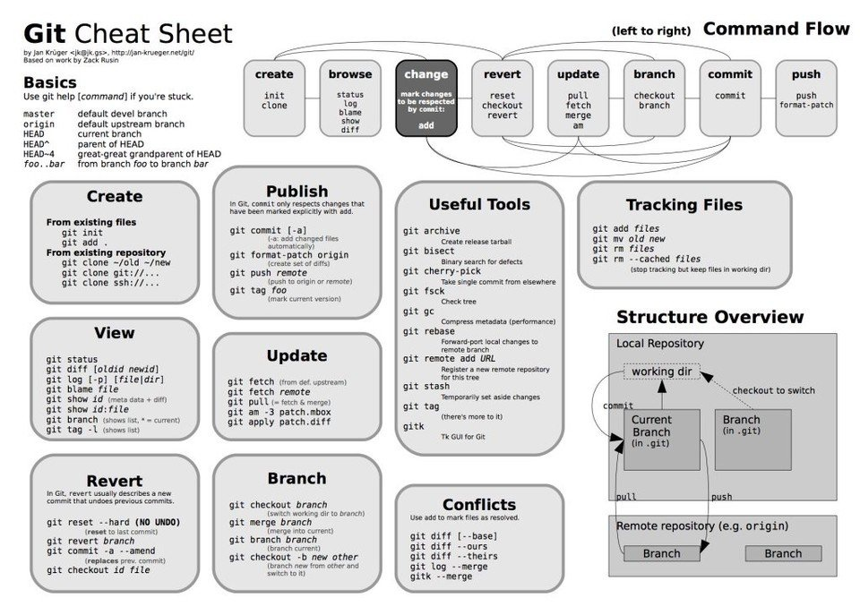

### More Reference
```
https://www.freecodecamp.org/news/git-cheat-sheet/
```
### Git Add Remote
```
git remote add origin git@github.com:User/UserRepo.git
git config --global user.email <email>
git config --global user.name <name>
```
### Git Show Remote Info
```
git remote show origin
```
### Git Clone
```
git clone -b <branch-name> <git-repository-url>
```
### Git Pull/Add/Commit/Tag/Push
```
git pull origin <branch_name>
git add .
git commit -m 'My Message'
git tag <tag_name>
git push origin <branch-name>
```
### Git Push Tags
```
//Tags should be only added per latest commit
git push origin --tags
//Delete local tag
git tag --delete tagname
//Delete remote tag
git push --delete origin tagname
```
### Git Checkout
```
//Select your prefered branch
git checkout <branch name>
```
### Git Clone
```
git clone <https://gitrepository>
git clone -b <branchname> <remote-repo-url>
```
### Delete All Commit before HEAD / Delete all commit
```
git reset --hard HEAD~1
```
### Reset specific commit
```
git reset --hard <commit-id>
```
### Git Log
```
//check list of commits
git log
```
### Remove a remote branch in Git
```
git push --delete origin branch_name_here
```
### Use Git rebase
```
You can transfer completed work from one branch to another using git rebase
$git checkout master_branch
$git rebase branch_name_here
```
### Create Branch and Switch to it
```
git checkout -b branch_name
```
### Switch to newly created Branch
```
git checkout branch_name
```
### Create Branch
```
git branch branch_name
```
### Cheat Sheet
</img>
